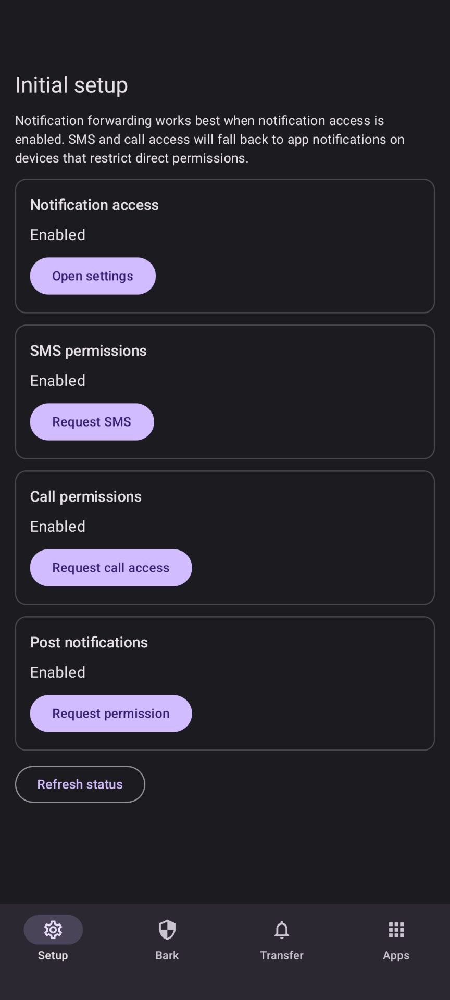
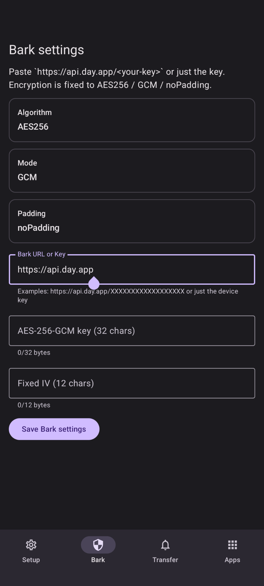
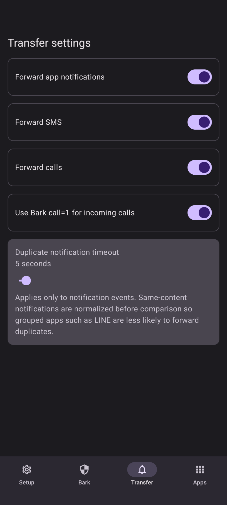
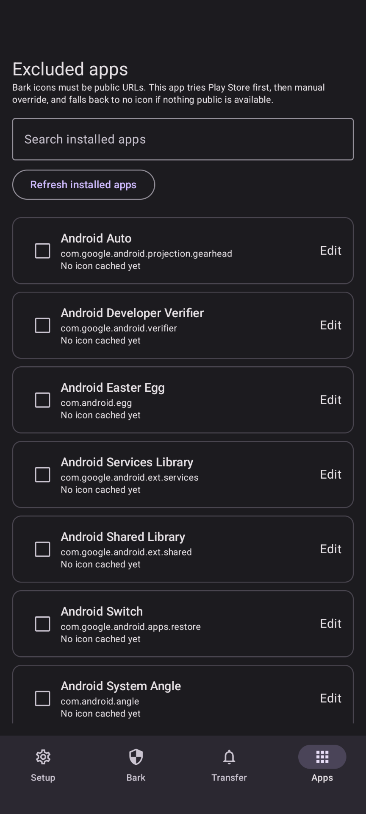

[English](README.md) | 日本語

# Bark Forwarder

Bark へ通知、SMS、通話イベントを AES-256-GCM で暗号化して転送する Android アプリです。

## スクリーンショット

<table>
  <tr>
    <td align="center">
      <br>
      <sub>Initial setup</sub>
    </td>
    <td align="center">
      <br>
      <sub>Bark settings</sub>
    </td>
  </tr>
  <tr>
    <td align="center">
      <br>
      <sub>Transfer settings</sub>
    </td>
    <td align="center">
      <br>
      <sub>Excluded apps</sub>
    </td>
  </tr>
</table>

## 機能

- `https://api.day.app/push` への Bark 専用転送
- Bark 互換の `ciphertext` と固定 `iv` を使った AES-256-GCM 暗号化
- アプリごとの除外ルール付き通知転送
- `1〜120秒`、初期値 `5秒` の重複通知タイムアウト
- 直接権限が使えない端末でも通知フォールバック付きで SMS / 通話を転送
- パッケージ名から Play Store アイコン URL を自動解決してキャッシュ
- アプリごとの手動アイコン URL 上書き
- 公開 URL を持つ通知画像を Bark の `image` として転送

## Build

GitHub Actions とローカル Gradle ビルドの両方に対応しています。

```bash
gradle testDebugUnitTest
gradle assembleDebug
```

## インストール

- ローカル確認用には `app/build/outputs/apk/debug/app-debug.apk` をインストールしてください。
- `app-release-unsigned.apk` は未署名なので、そのままではインストールできません。配布用に使う場合は別途 signing config が必要です。

## 外部 APK の通知アクセス注意

外部からインストールした APK では、通知アクセスをすぐ有効化できず、先に制限付き設定の許可が必要になることがあります。

1. まずアプリ側から通知アクセス要求を開きます。
2. 設定アプリで `Notification Transfer` のアプリ詳細画面を開きます。
3. 右上の 3 点メニューから制限付き設定の許可を有効にします。
4. そのあとで通知アクセスを有効化します。

端末や Android のバージョンによって表記は少し違うことがありますが、流れとしては「先に制限付き設定を許可してから通知アクセスを有効化する」で共通です。

## Bark 設定

iPhone 側の Bark アプリでは次の値をそろえてください。

- Algorithm: `AES256`
- Mode: `GCM`
- Padding: `noPadding`
- Key: Android アプリに入力したものと同じ 32 文字キー
- IV: Android アプリに入力したものと同じ 12 文字 IV

<p>
  <a href="https://apps.apple.com/app/bark-custom-notifications/id1403753865">
    
  </a>
</p>

Android アプリ側の `Bark URL or Key` には `https://api.day.app/<your-key>` をそのまま貼り付けるか、デバイスキー単体を入力できます。送信形式は Bark の Node.js GCM サンプルと同じ `ciphertext` + `iv` です。

Bark は Finb による別アプリです。

## アイコンと画像

- Bark の `icon` と `image` は公開 URL が前提です。
- 通知アイコンはまずPlay Store WebからアイコンのURLの取得を試みます。
- Play から取得できない場合は、アプリごとに手動の icon URL を設定できます。
- 通知画像は元通知の中に `http` または `https` の公開 URL がある場合だけ転送されます。
- 公開 URL がなければ、アイコンや画像なしで本文だけ送信します。
- このリポジトリには Bark のUIスクリーンショットやアプリアートワークを同梱しません。

## Duplicate Notification Timeout

- 重複フィルタが効くのはアプリ通知だけです。
- 比較には `subText` や category の揺れではなく、正規化した通知本文を使います。
- LINE のような grouped notification でも、summary 通知と個別通知が同じ内容なら重複抑止にまとまりやすくしています。
- SMS と通話は直接転送を優先しつつ、notification fallback 時だけ小さな機械的 dedupe をかけます。

## 権限

このアプリが要求する主な権限は次のとおりです。

- アプリ通知を拾うための通知アクセス
- SMS を直接読むための SMS 権限
- 通話イベントを直接拾うための電話状態 / 通話履歴権限
- 再起動後にアプリ一覧を更新するための `BOOT_COMPLETED`

端末や導入方法によっては SMS / 通話の直接権限が制限されることがあります。その場合は、既定の SMS アプリや電話アプリの通知をフォールバックとして転送します。
