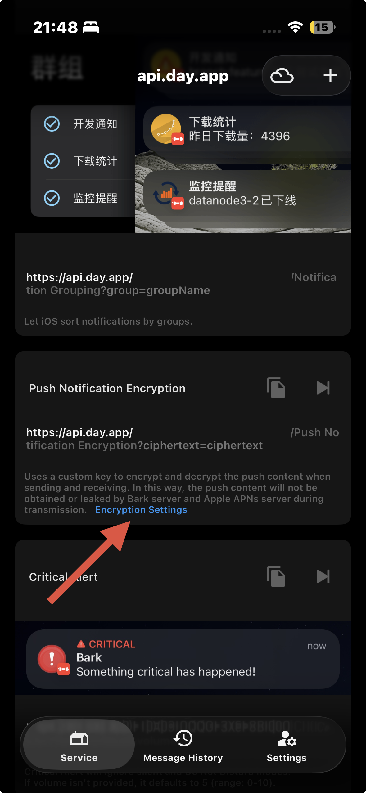

English | [日本語](README.ja.md)

# Bark Forwarder

Android app that forwards notifications, SMS, and call events to Bark with AES-256-GCM encrypted payloads.

## Screenshots

<table>
  <tr>
    <td align="center">
      <br>
      <sub>Initial setup</sub>
    </td>
    <td align="center">
      <br>
      <sub>Bark settings</sub>
    </td>
  </tr>
  <tr>
    <td align="center">
      <br>
      <sub>Transfer settings</sub>
    </td>
    <td align="center">
      <br>
      <sub>Excluded apps</sub>
    </td>
  </tr>
</table>

## Features

- Bark-only forwarding to `https://api.day.app/push`
- AES-256-GCM payload encryption using Bark-compatible `ciphertext` and fixed `iv`
- Notification listener forwarding with per-app exclusion rules
- Duplicate notification timeout configurable from 1 to 120 seconds, default 5
- SMS and call forwarding with notification fallback when direct permissions are unavailable
- Automatic Play Store icon resolution from package name with cached results
- Optional manual icon URL override per app
- Public image URL forwarding to Bark `image`

## Build

This repository is set up for GitHub Actions and local Gradle builds.

```bash
gradle testDebugUnitTest
gradle assembleDebug
```

## Install

- Install `app/build/outputs/apk/debug/app-debug.apk` for local testing.
- `app-release-unsigned.apk` is intentionally unsigned and will not install until you add your own signing config.

## Notification Access Note for Sideloaded APKs

If you installed the app from an external APK, Android may block notification access until you manually allow restricted settings first.

1. Open the notification access prompt from inside the app.
2. In the Settings app, open the `Notification Transfer` app details page.
3. Open the top-right three-dot menu and allow restricted settings.
4. Go back and enable notification access for the app.

The wording can differ a little depending on your Android version or device vendor, but the flow is the same: allow restricted settings first, then turn on notification access.

## Bark Setup

Configure the Bark iPhone app with:

- Algorithm: `AES256`
- Mode: `GCM`
- Padding: `noPadding`
- Key: same 32-character key entered in the Android app
- IV: same 12-character IV entered in the Android app



The Android app sends `ciphertext` and `iv` in the same format as Bark's Node.js GCM example. You can paste `https://api.day.app/<your-key>` directly into the Android app, or paste the key by itself.

## Icons and Images

- Bark `icon` and `image` require public URLs.
- This app tries to resolve notification icons from the Play Store Web first.
- If Play resolution fails, you can set a manual icon URL per app.
- Notification images are only forwarded when the original notification already exposes a public `http` or `https` URL.
- If nothing public is available, the push is still sent without an icon.

## Duplicate Notification Timeout

- Duplicate filtering applies only to app notifications.
- The timeout compares normalized notification content instead of `subText` or category noise.
- Grouped apps such as LINE reuse extra content-aware keys so summary and child notifications can collapse into one forward when they describe the same message.
- SMS and call events still use direct delivery, plus a small fallback dedupe window only when the event came from notification fallback.

## Permissions

The app requests:

- Notification access for app notifications
- SMS permissions for direct SMS reads
- Phone state and call log access for direct call events
- Boot completed for app list refresh after restart

Some SMS and call permissions are restricted on certain devices or installers. When that happens, the app falls back to forwarding notifications from the default SMS or phone app instead.
